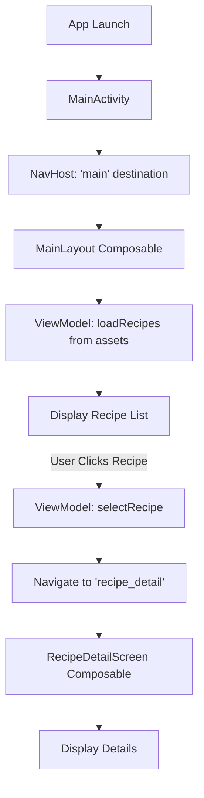
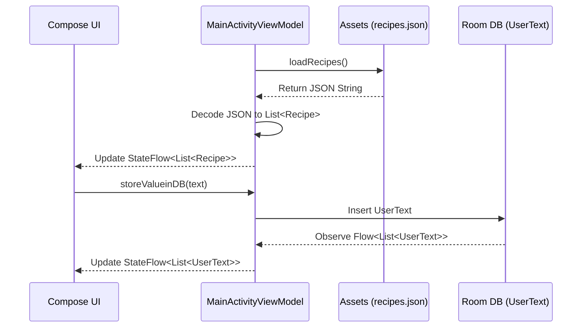

# Hmaara Cook - Recipe Management App

Hmaara Cook is a modern Android application built with Jetpack Compose that allows users to browse and view detailed information about various recipes. It leverages the latest Android development practices, including MVVM architecture, Room database for local persistence, and Kotlin Serialization for data parsing.

## Table of Contents
1. [Features](#features)
2. [Tech Stack](#tech-stack)
3. [Architecture](#architecture)
4. [Application Flow](#application-flow)
5. [Data Flow Diagrams](#data-flow-diagrams)
6. [Project Structure](#project-structure)

## Features
- **Recipe Browsing**: View a list of available recipes with ease.
- **Detailed View**: Access detailed information for each recipe, including ingredients and cooking instructions.
- **Data Persistence**: Uses Room DB to store and manage user-related text entries.
- **JSON Integration**: Loads recipe data from a local JSON asset file.

## Tech Stack
- **UI**: [Jetpack Compose](https://developer.android.com/jetpack/compose) for a declarative UI.
- **Navigation**: [Compose Navigation](https://developer.android.com/jetpack/compose/navigation) for seamless screen transitions.
- **Architecture**: MVVM (Model-View-ViewModel).
- **Database**: [Room](https://developer.android.com/training/data-storage/room) for local SQLite storage.
- **Serialization**: [Kotlinx Serialization](https://github.com/Kotlin/kotlinx.serialization) for JSON parsing.
- **Dependency Management**: Gradle Version Catalog (`libs.versions.toml`).

## Architecture
The app follows the **MVVM (Model-View-ViewModel)** architectural pattern to ensure separation of concerns and testability.

- **Model**: Represents the data layer (e.g., `Recipe` data class, Room entities like `UserText`).
- **View**: Composed of Jetpack Compose functions (`MainLayout`, `RecipeDetailScreen`) that observe the ViewModel.
- **ViewModel**: (`MainActivityViewModel`) Manages UI-related data and communication with the data layer (Room DB and Assets).

## Application Flow

1.  **Launch**: The app starts with `MainActivity`, which sets up the `NavHost`.
2.  **Main Screen**: The user is presented with a list of recipes fetched from `recipes.json`.
3.  **Selection**: Tapping a recipe triggers the ViewModel to update the `selectedRecipe` state.
4.  **Navigation**: The app navigates to the `recipe_detail` screen.
5.  **Detail Screen**: Displays the ingredients and instructions of the selected recipe.
6.  **Back Navigation**: Users can return to the list via the top bar's back button.

## Data Flow Diagrams

### High-Level Flow


### ViewModel Data Fetching


## Project Structure
```text
com.example.hmaaracook
├── data
│   ├── local         # Room Database, DAOs, and Entities
│   └── model         # Data models (e.g., Recipe)
├── ui
│   ├── activity      # Entry point (MainActivity)
│   ├── layouts       # Main Composable screens
│   └── theme         # Compose UI Theme definitions
└── viewmodel         # MainActivityViewModel
```

## Setup & Build
1. Clone the repository.
2. Open in Android Studio (Ladybug or newer).
3. Ensure you have the latest Compose dependencies synced.
4. Run the `:app` module.
