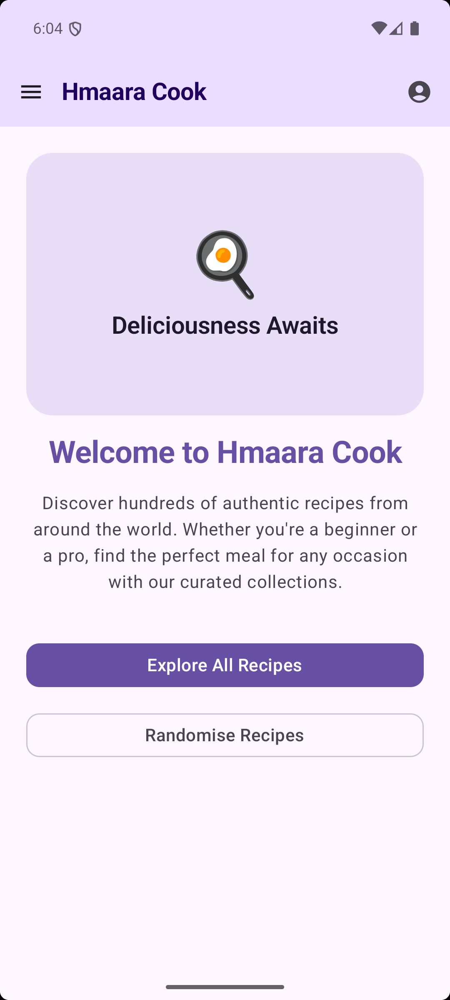
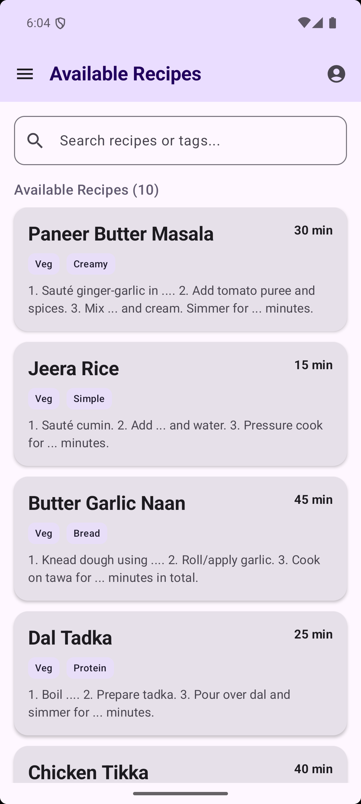
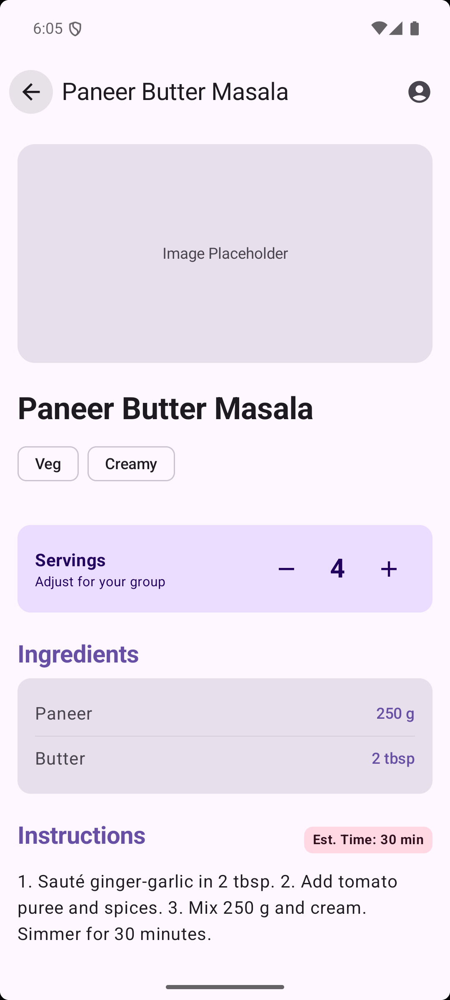
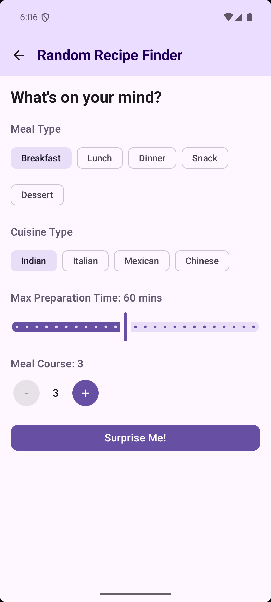
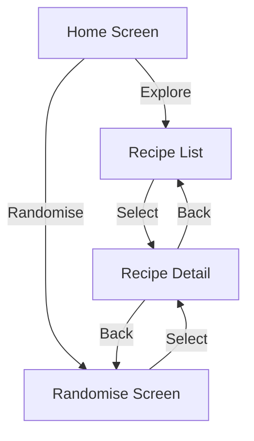
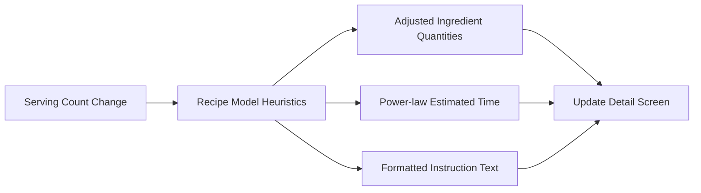

# Hmaara Cook - Recipe Management App

Hmaara Cook is a modern Android application built with Jetpack Compose that allows users to browse, search, and discover recipes. It features dynamic serving scaling, a random recipe finder, and local data persistence.

## Screenshots
| Home Screen | Recipe List | Recipe Detail | Randomiser |
|:---:|:---:|:---:|:---:|
|  |  |  |  |

## Table of Contents
1. [Features](#features)
2. [Tech Stack](#tech-stack)
3. [Architecture](#architecture)
4. [Application Flow](#application-flow)
5. [Data Flow Diagrams](#data-flow-diagrams)
6. [Project Structure](#project-structure)
7. [Setup & Build](#setup--build)

## Features
- **Recipe Browsing & Search**: Explore a wide range of recipes with a powerful search by name or tags.
- **Dynamic Serving Scaling**: Automatically adjust ingredient quantities and estimated cooking times based on the number of servings.
- **Random Recipe Finder**: Get personalized recipe suggestions based on meal type (Breakfast, Lunch, Dinner, etc.), cuisine, and preparation time.
- **Detailed Instructions**: Smart instructions that update quantities and times dynamically as you scale the recipe.
- **Data Persistence**: Uses Room DB for local storage of recipes and user-related data.
- **JSON Integration**: Initial recipe data is loaded and synced from a local `recipes.json` asset file.

## Tech Stack
- **UI**: [Jetpack Compose](https://developer.android.com/jetpack/compose) for a modern, declarative UI.
- **Navigation**: [Compose Navigation](https://developer.android.com/jetpack/compose/navigation) for screen transitions.
- **Architecture**: MVVM (Model-View-ViewModel) with Repository pattern.
- **Database**: [Room](https://developer.android.com/training/data-storage/room) for local SQLite persistence.
- **Serialization**: [Kotlinx Serialization](https://github.com/Kotlin/kotlinx.serialization) for JSON parsing.
- **Concurrency**: Kotlin Coroutines and Flow for reactive data streams.

## Architecture
The app follows a clean **MVVM (Model-View-ViewModel)** architectural pattern.

- **Model**: Data structures (`Recipe`, `Ingredient`) and Room entities.
- **Repository**: Acts as a mediator between different data sources (Assets, Room DB).
- **ViewModel**: (`MainActivityViewModel`) Manages UI state and coordinates data operations.
- **View**: Composable functions (`HomeScreen`, `MainLayout`, `RandomiseRecipeScreen`) that observe state from the ViewModel.

## Application Flow

1.  **Home Screen**: The entry point offering quick access to explore all recipes or use the Randomiser.
2.  **Recipe List**: Displays all available recipes with filtering capabilities.
3.  **Randomiser**: A specialized tool to find recipes matching specific preferences (meal type, time, cuisine).
4.  **Recipe Detail**: Provides an in-depth look at ingredients and steps, with interactive serving controls.

## Data Flow Diagrams

### Navigation Flow


### Dynamic Scaling Logic


## Project Structure
```text
com.example.hmaaracook
├── common         # Global constants and enums (CookingConstants)
├── data
│   ├── local      # Room Database, DAOs (RecipeDao, UserTextDao), and Entities
│   ├── model      # Data models (Recipe, Ingredient)
│   └── Repository # Repository layer for data abstraction
├── ui
│   ├── activity   # Main entry point (MainActivity)
│   ├── layouts    # Composable screens (HomeScreen, MainLayout, RandomiseRecipeScreen)
│   └── theme      # Compose UI Theme and styling
└── viewmodel      # MainActivityViewModel for state management
```

## Setup & Build
1. Clone the repository.
2. Open in Android Studio (Ladybug or newer).
3. Ensure Gradle sync is successful.
4. Run the `:app` module on an emulator or physical device.
